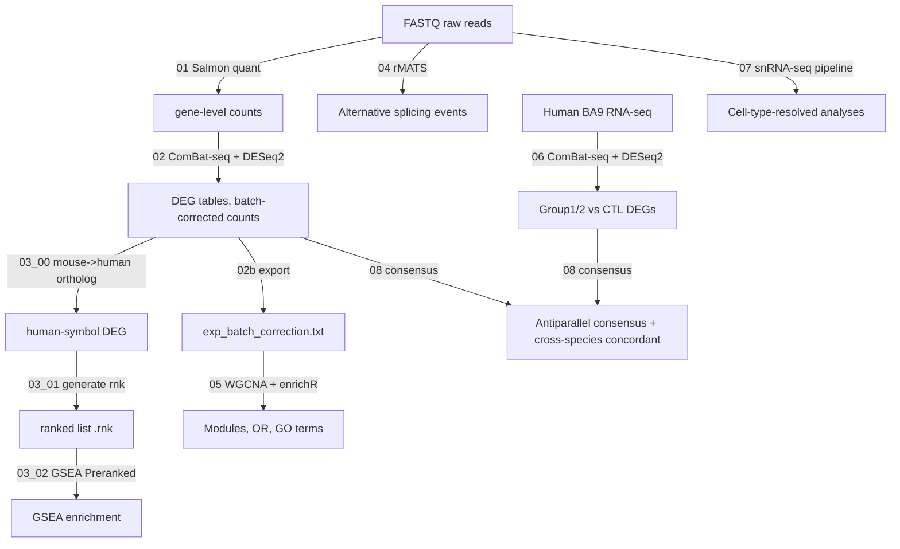

# Transcriptome-based subgrouping of ASD mouse models (v2.2)

Analysis pipeline and custom scripts for the manuscript
*"Transcriptome-based subgrouping of ASD mouse models"* (combioKISTI).

This v2.2 release adds the full single-nucleus RNA-seq pipeline under
`scripts/07_snrnaseq/` (Cell Ranger → QC / Harmony integration → Allen Brain Cell
Atlas annotation → cell-type composition → per-cell-type hdWGCNA). The bulk-RNA
cell-type deconvolution step (formerly `scripts/06_deconvolution/`) remains
omitted because the manuscript reports cell-type composition from snRNA-seq
directly, and the human BA9 step stays renumbered from 07 to 06.

---

## Pipeline overview



## Pipeline stages

| # | Step | Script | Output |
|---|------|--------|--------|
| 01 | Bulk RNA-seq mapping (Salmon) | `scripts/01_mapping/01_FASTQ_mapping_by_salmon.sh` | `quant.genes.sf` |
| 02 | DEG (DESeq2 + ComBat-seq) | `scripts/02_dge/02_Differential_Gene_Expression.R` | DEG tables, `combatCount.RData` |
| 02b | Merge ComBat counts for WGCNA | `scripts/02_dge/02b_export_combatcount.R` | `data/bulk/exp_batch_correction.txt` |
| 03.00 | Mouse → Human ortholog mapping | `scripts/03_gsea/03_00_mouse_to_human_ortholog.R` | `*_all_human.txt` |
| 03.01 | Generate ranked list | `scripts/03_gsea/03_01_generate_rnk.sh` | `*.rnk` |
| 03.02 | GSEA Preranked | `scripts/03_gsea/03_02_run_GSEA.sh` | GSEA reports |
| 04 | Alternative splicing (rMATS) | `scripts/04_splicing/04_Alternative_Splicing_analysis.sh` | rMATS event tables |
| 05 | WGCNA + enrichR | `scripts/05_wgcna/05_WGCNA_analysis.R` | modules, OR, GO terms |
| 06 | Human BA9 RNA-seq | `scripts/06_human/06_human_rnaseq.R` | `deseq2_Group{1,2}.txt` |
| 07 | snRNA-seq analysis | `scripts/07_snrnaseq/` (Cell Ranger → QC/Harmony → Allen annotation → composition → hdWGCNA) | annotated Seurat objects, composition stats, co-expression modules |
| 08 | Consensus & cross-species concordance | `scripts/08_consensus/` (Wilcoxon → antiparallel consensus → hypergeometric → ortholog) | overlapped genes, p-values, concordant genes |

> v2.2 changes vs v2.1: full snRNA-seq pipeline added under
> `scripts/07_snrnaseq/` (5 scripts).
> v2.1 changes vs v2: bulk-RNA deconvolution (old step 06) removed; human BA9
> renumbered from 07 to 06.

## Repository layout

```
.
├── README.md
├── LICENSE
├── CITATION.cff
├── .gitignore
├── config/
│   └── paths.sh                   # Common environment variables
├── environment/
│   ├── tools_versions.md          # CLI tool versions used
│   └── R_sessionInfo_template.txt # R / Bioconductor versions
├── scripts/
│   ├── 01_mapping/
│   ├── 02_dge/
│   ├── 03_gsea/
│   ├── 04_splicing/
│   ├── 05_wgcna/
│   ├── 06_human/                 # Human BA9 RNA-seq (renumbered from 07)
│   ├── 07_snrnaseq/              # snRNA-seq: Cell Ranger, QC/Harmony, annotation, hdWGCNA
│   └── 08_consensus/             # Wilcoxon antiparallel + hypergeometric + cross-species
└── data/
    ├── README.md                  # Data sources (GEO/dbGaP)
    ├── rnaseq_sample_metadata.txt
    └── human_rnaseq_sample_metadata.txt
```

## System requirements

| Tool / Package | Version |
|----------------|---------|
| R | ≥ 4.2 |
| Python | ≥ 3.8 |
| Salmon | 1.1.0 |
| STAR | (your version) |
| rMATS | 4.0.2 |
| GSEA (CLI) | 4.3.3 |
| MSigDB | v2023.2.Hs |
| DESeq2 / sva / WGCNA / tximport / biomaRt / enrichR | see `environment/R_sessionInfo_template.txt` |

## Quick start

```bash
# 1. Configure paths
cp config/paths.sh config/paths.local.sh   # edit local paths
source config/paths.local.sh

# 2. Map reads (per sample)
export TAG=ADNP_Male_HfM_1
bash scripts/01_mapping/01_FASTQ_mapping_by_salmon.sh

# 3. DEG per strain x sex
export TAG=ADNP_Male GENE=ADNP
Rscript scripts/02_dge/02_Differential_Gene_Expression.R

# 4. Export merged ComBat counts for WGCNA
export TAGS="ADNP_Male ADNP_Female CHD8_Male ..."
Rscript scripts/02_dge/02b_export_combatcount.R

# 5. Mouse -> human ortholog -> rnk -> GSEA
export GENE=ADNP COMPTAG=ADNP_Male SAMPLE=ADNP_Male
Rscript scripts/03_gsea/03_00_mouse_to_human_ortholog.R
bash scripts/03_gsea/03_01_generate_rnk.sh \
     "$WORKDIR/$COMPTAG/${GENE}_deseq2_${COMPTAG}_all_human.txt" 7 3 6
bash scripts/03_gsea/03_02_run_GSEA.sh

# 6. WGCNA + Human BA9
Rscript scripts/05_wgcna/05_WGCNA_analysis.R
Rscript scripts/06_human/06_human_rnaseq.R

# 7. snRNA-seq analysis (see scripts/07_snrnaseq/README.md)
for TAG in $(cat "$WORKDIR/cellranger/sample_list.txt"); do
  TAG="$TAG" bash scripts/07_snrnaseq/07_cellranger_multi.sh
done
Rscript scripts/07_snrnaseq/07_qc_integration.R
Rscript scripts/07_snrnaseq/07_annotation.R
Rscript scripts/07_snrnaseq/07_hdWGCNA.R

# 8. Consensus and cross-species concordance
bash scripts/08_consensus/pipelines/run_mouse_consensus.sh synaptic data/...
bash scripts/08_consensus/pipelines/run_human_consensus.sh synaptic data/...
bash scripts/08_consensus/pipelines/run_hypergeometric.sh
bash scripts/08_consensus/pipelines/run_cross_species.sh synaptic
```

## Data

See [data/README.md](data/README.md) for download instructions.
- Mouse bulk RNA-seq: GEO accession (TBD when manuscript is public)
- Human bulk RNA-seq: [dhglab/Broad-transcriptomic-dysregulation-across-the-cerebral-cortex-in-ASD](https://github.com/dhglab/Broad-transcriptomic-dysregulation-across-the-cerebral-cortex-in-ASD)

## Authors

- **Hyojin Kang** (KISTI) — DEG, GSEA, human RNA-seq, consensus and cross-species concordance
- **Yukyung Jun** — Alternative splicing, WGCNA

## Citation

See [CITATION.cff](CITATION.cff). When using this code, please cite the
manuscript (publication details to follow).

## License

MIT — see [LICENSE](LICENSE).
